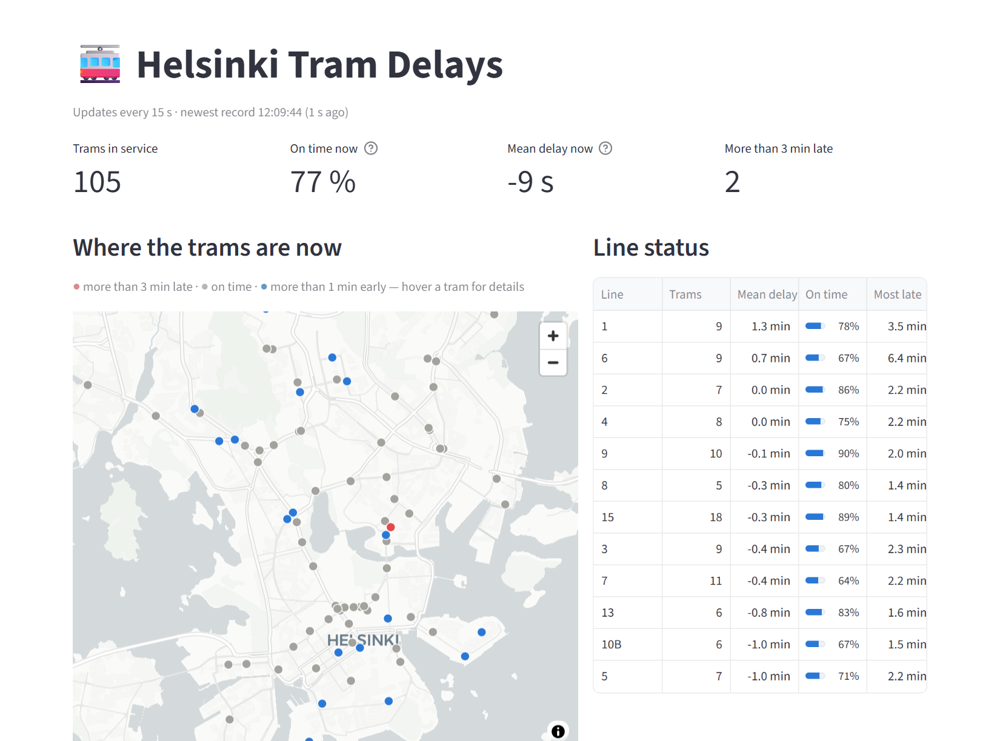
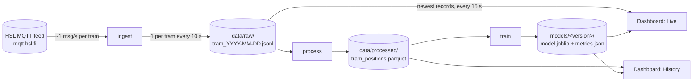
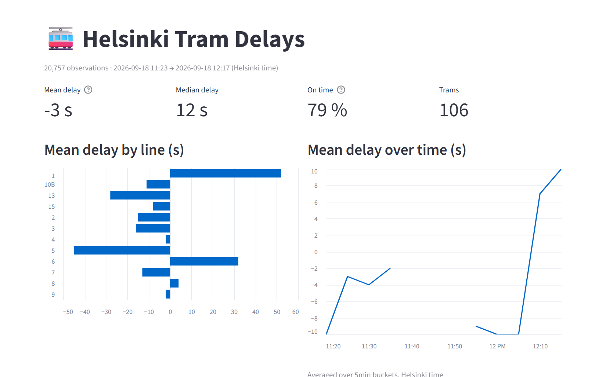
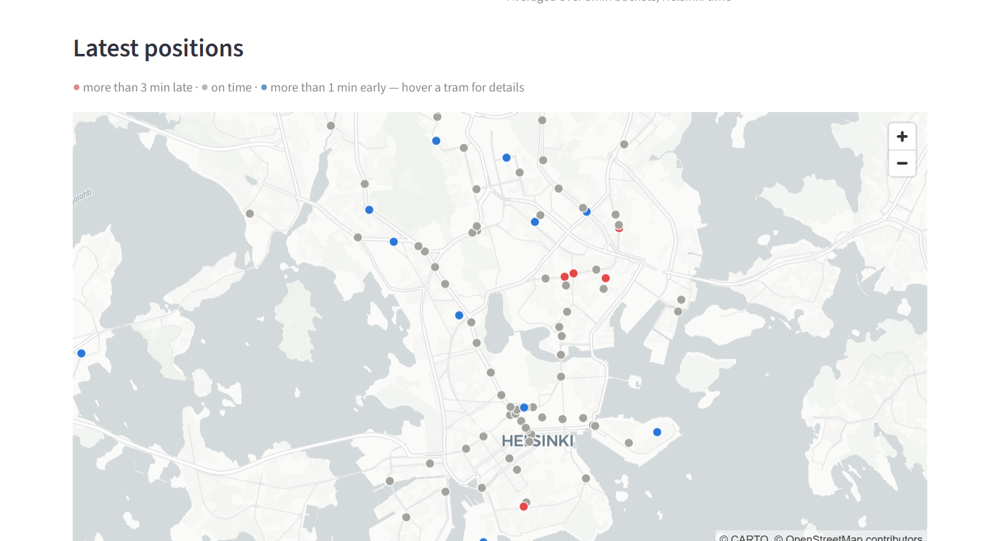
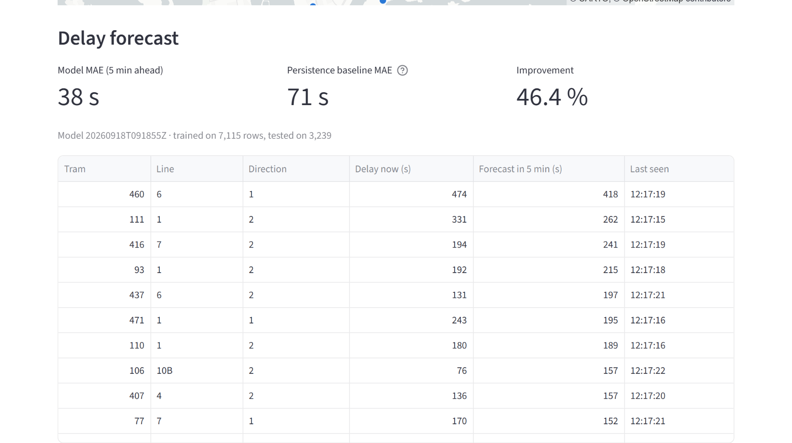
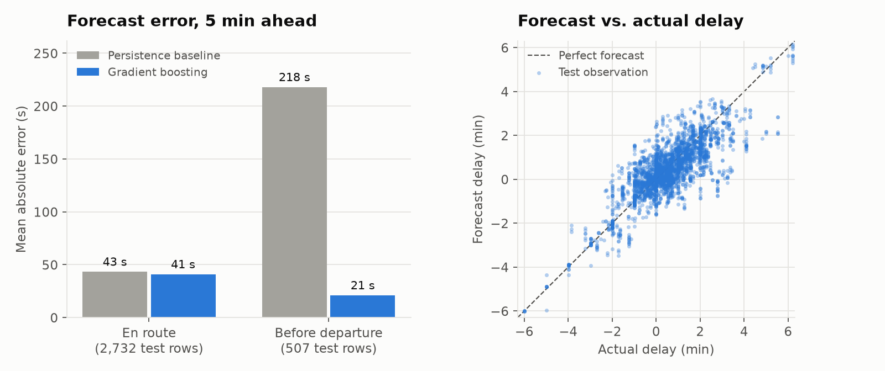
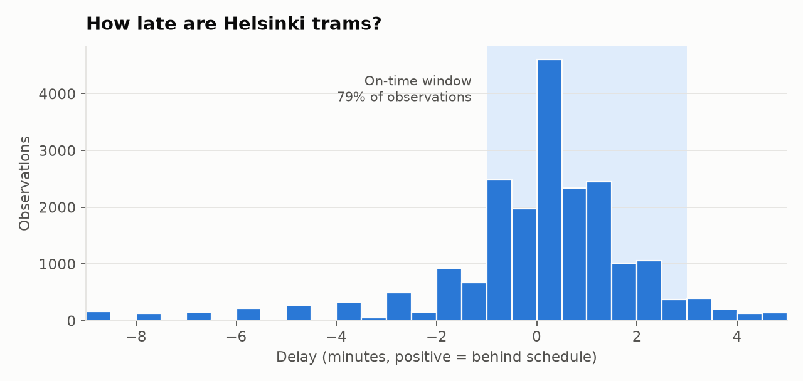
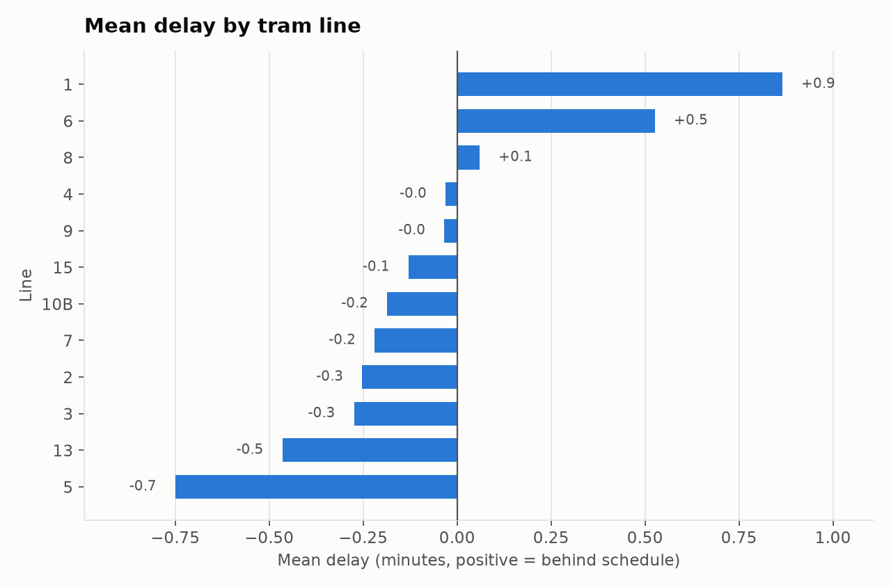

# 🚋 Helsinki Tram MLOps

[](https://github.com/girimohan/helsinki-tram-mlops/actions/workflows/ci.yml)


An end-to-end pipeline for real-time data and machine learning. It collects **live GPS positions of every tram in Helsinki**, cleans them into an analysis-ready dataset, trains a model that **forecasts each tram's delay 5 minutes ahead**, and serves everything in a **live dashboard** that refreshes every 15 seconds.



<sub>Live view on 18 Sep 2026, 12:09 (Helsinki time): 104 trams in service. Dot colours show trams running late, on time or early.</sub>

---

## Highlights

- **Real data, streamed live.** Subscribes to Helsinki Region Transport's public [high-frequency positioning feed](https://digitransit.fi/en/developers/apis/5-realtime-api/vehicle-positions/) over MQTT (about 100 messages per second).
- **Complete MLOps loop.** Ingest → process → train → versioned model → dashboard, with config files, tests, CI and Docker.
- **Honest evaluation.** The model is compared with a persistence baseline on a time-based split that prevents leakage, and results are broken down by segment. The breakdown exposes where the model really helps and where it barely does ([details](#model)).
- **Data-quality fixes found in the raw feed.** The feed uses an inverted sign for delay, contains stale journey sign-ins that look like 2‑hour delays, and delivers duplicate messages. Each is handled and covered by a test ([details](#data-quality-findings)).

## Contents

- [How it works](#how-it-works)
- [Quick start](#quick-start)
- [Dashboard](#dashboard)
- [Model](#model)
- [Data-quality findings](#data-quality-findings)
- [Project structure](#project-structure)
- [Configuration](#configuration)
- [Testing and CI](#testing-and-ci)
- [Roadmap](#roadmap)
- [Data and attribution](#data-and-attribution)

---

## How it works



| Stage | Command | What it does |
|---|---|---|
| **Ingest** | `python -m tram_mlops.ingest` | Subscribes to all tram positions, keeps one message per tram every 10 s, and appends to one JSONL file per day. Reconnects automatically if the connection drops. |
| **Process** | `python -m tram_mlops.process` | Parses and deduplicates records, fixes the delay sign, removes stale journeys, converts times to Helsinki local time, and writes Parquet. |
| **Train** | `python -m tram_mlops.train` | Builds features, splits by time, trains gradient boosting, compares it with the baseline, and saves a versioned model. |
| **Dashboard** | `streamlit run src/tram_mlops/dashboard.py` | A **Live** view that reads the ingester's newest data directly, and a **History** view of the processed dataset. |

## Quick start

Requires Python 3.11+.

```bash
git clone https://github.com/girimohan/helsinki-tram-mlops.git
cd helsinki-tram-mlops
python -m venv venv
source venv/bin/activate            # Windows: venv\Scripts\activate
pip install -r requirements.txt
pip install --no-deps -e .
```

Run the pipeline in separate terminals:

```bash
python -m tram_mlops.ingest                       # 1. collect live data (Ctrl+C to stop)
streamlit run src/tram_mlops/dashboard.py         # 2. open http://localhost:8501; Live view appears automatically

# after 30+ minutes of collection:
python -m tram_mlops.process                      # 3. build the dataset
python -m tram_mlops.train                        # 4. train and version a model
```

No time to collect? `process` falls back to a small bundled sample (`data/sample/`), so the History view works immediately.

### Docker

```bash
docker compose up -d ingest dashboard     # collector + dashboard on http://localhost:8501
docker compose run --rm pipeline          # process + train; run periodically, e.g. from cron
```

## Dashboard

**Live** view (screenshot at the top): trams in service, the share on time, a live map, a line-by-line status board and live forecasts. It refreshes every 15 seconds and warns if the collector stops sending data.

**History** view: KPIs and trends across everything collected.



The **map** puts each tram at its latest position, coloured by punctuality. Hover over a tram for its line, delay and last-seen time.



The **forecast panel** shows the current model's accuracy against the baseline and each tram's forecast delay 5 minutes ahead.



## Model

**Task:** predict a tram's delay 5 minutes ahead on the same journey.

**Baseline:** *persistence*, which assumes the delay stays as it is now. It is the natural benchmark for short-term forecasting and is surprisingly hard to beat.

**Model:** `HistGradientBoostingRegressor` (scikit-learn), which predicts the *change* in delay. Features include the current delay, the delay trend over the last 60 s, time since the scheduled departure, speed, whether doors are open or the tram is at a stop, position, line and direction, and time of day. Every feature uses only current and past observations.

**Evaluation:** a time-based split. The model trains on earlier data and is tested on the last 25%. Training rows whose 5‑minute target would fall inside the test period are removed. Without that purge, a first run overstated the improvement (45% instead of 32% on the same data).

### Results

The model was trained on 35 minutes of live data collected in two sessions on 18 Sep 2026 (7,115 training rows, 3,239 test rows, 105 trams).

| 5‑min‑ahead forecast | Test rows | Baseline MAE | Model MAE | Improvement |
|---|---:|---:|---:|---:|
| All observations | 3,239 | 70.7 s | **37.9 s** | 46% |
| En route (tram has departed) | 2,732 | 43.4 s | **41.0 s** | 5% |
| Before departure (waiting at terminus) | 507 | 218.0 s | **21.1 s** | 90% |



**What this means:** the headline 46% is real but **mostly comes from trams that haven't departed yet.** A tram waiting at its terminus reports a large "early" offset until it leaves, which the baseline takes at face value. The model learns this pattern: *time since scheduled departure* is its most important feature by permutation importance. **For trams already moving, the model is only slightly better than the baseline.** Improving that segment needs weeks of data covering different times of day, weekdays and weather. Every training run records this breakdown in `metrics.json`.

## Data-quality findings

Exploring the raw feed turned up several problems that silently distort results if left in. Each fix is covered by a test.

| Finding | Impact | Fix |
|---|---|---|
| HSL's `dl` field is **positive when a tram is *ahead*** of schedule | The original analysis reported every delay with the wrong sign | `delay_s = -dl`, so positive means late |
| Some trams stay **signed into a journey hours after it ended** | 913 of 21,948 rows (4%) show fake delays of 1–2.5 h; in the first live run they pushed the mean delay to **+237 s instead of −3 s** | Drop rows where \|delay\| > 30 min (configurable) |
| The broker can **deliver the same message twice** | The first sample file contained every record twice | Deduplicate on (tram, timestamp) |
| Line **"000"** (route `1009TX`) is not a public line | It appeared as the most delayed "line" in the first live run | Excluded through `exclude_lines` in config |
| Timestamps are **UTC** | Hour-of-day charts were shifted by 2–3 hours | Converted to `Europe/Helsinki` |





<sub>Figures are based on 20,757 observations from 18 Sep 2026, 11:23–12:17 Helsinki time (collection paused 11:38–11:58). Mean delay −3 s, median +12 s, 79% within the on-time window of 1 min early to 3 min late.</sub>

## Project structure

```
helsinki-tram-mlops/
├── src/tram_mlops/
│   ├── ingest.py        # MQTT collector → daily JSONL
│   ├── process.py       # cleaning, deduplication, live tail reader
│   ├── features.py      # leakage-free features and 5-min-ahead target
│   ├── train.py         # time split, model, baseline, versioning
│   ├── dashboard.py     # Streamlit app (Live + History)
│   └── config.py        # TOML config with env-var overrides
├── configs/config.toml  # every tunable setting
├── tests/               # 28 pytest tests, including dashboard smoke tests
├── scripts/             # figure and screenshot generation for this README
├── data/sample/         # small bundled sample (Feb 2026)
├── docs/images/         # README figures and screenshots
├── Dockerfile, docker-compose.yml
└── .github/workflows/ci.yml
```

## Configuration

All settings live in [`configs/config.toml`](configs/config.toml): sampling interval, on-time window, outlier threshold, forecast horizon, dashboard refresh rate and more. You can override any of them without editing the file by setting an environment variable named `TRAM_<SECTION>_<KEY>`:

```bash
TRAM_MODEL_HORIZON_S=600 python -m tram_mlops.train      # 10-minute forecast
TRAM_INGEST_SAMPLE_INTERVAL_S=5 python -m tram_mlops.ingest
```

## Testing and CI

```bash
pytest          # 28 tests, about 10 s
```

The tests cover the delay sign convention, deduplication, outlier and line filtering, time zones, and leakage-free target construction. They also cover the purged time split, segment metrics, reading the tail of a file that's still being written (including across UTC midnight), the ingester's downsampling and daily file rollover, and the dashboard in both modes. The dashboard tests use Streamlit's headless `AppTest`. GitHub Actions runs the suite and a pipeline smoke test on every push.

To regenerate this README's figures and screenshots:

```bash
pip install -e ".[docs]"
python scripts/make_figures.py
python scripts/screenshot_dashboard.py     # drives your installed Chrome; run while the collector is on to capture the Live view
```

## Roadmap

- **More data.** Run the collector for several weeks so the model sees rush hours, weekends and weather. This is the main lever for the en-route forecast.
- **Reliability per stop, line and hour.** For example: "Line 7 at Senaatintori, weekdays 8–9 am: on time 62% of the time." The HSL app shows the current delay but not how reliable a line *usually* is.
- **"When should I leave?"** For a chosen stop and arrival deadline, suggest a departure time that is on time 90% of the time, based on past delays.
- **Where delays build up.** Map the street segments where trams lose time, useful input for tram signal priority.
- **Production operations.** Scheduled retraining, promoting a new model only when it beats the current one, drift monitoring and a database instead of files.

## Data and attribution

Vehicle position data: © [Helsinki Region Transport (HSL)](https://www.hsl.fi/en/hsl/open-data), licensed under [CC BY 4.0](https://creativecommons.org/licenses/by/4.0/). Map tiles © [CARTO](https://carto.com/attributions), © [OpenStreetMap](https://www.openstreetmap.org/copyright) contributors.
